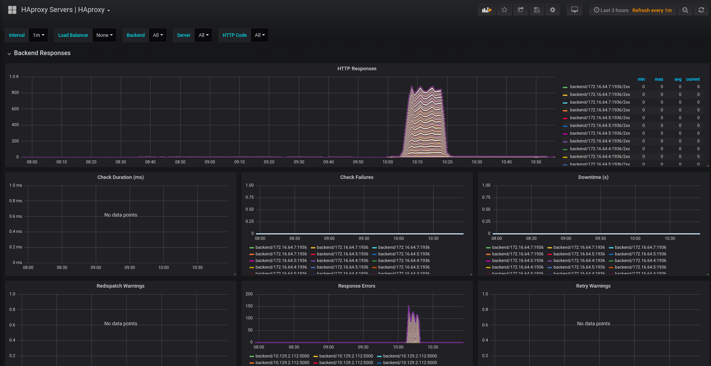
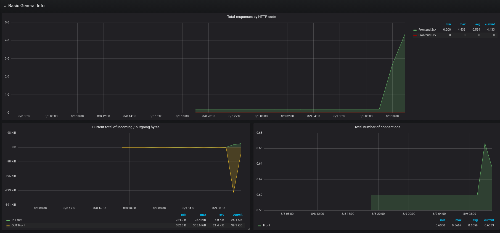
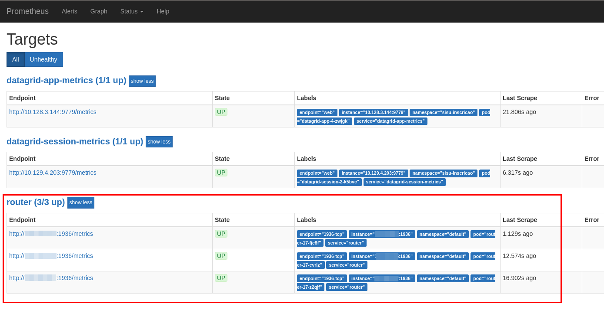

# Openshift 3.11 Prometheus + Grafana Router Monitoring

Openshift Router (HAProxy) Monitoring using Prometheus and Grafana





## Pre-req

### Iptables

Make sure port `1936` is open on every infra node. You need to allow access to this port using the following command:

```bash
iptables -A OS_FIREWALL_ALLOW -p tcp -m state --state NEW -m tcp --dport 1936 -j ACCEPT
```

> This is not permanent. You will lose this rule whenever infra node is restarted

### Router Configuration

#### Deployment Configuration

Set your router vars as following:

* `STATS_PORT` = 1936
* `ROUTER_METRICS_TYPE` = haproxy

Change username and password for metrics:

```bash
oc set env dc/router STATS_USERNAME=myuser STATS_PASSWORD=mypass -n default
```

You can check if everything is right running:

```bash
oc -n default get dc router --export -o yaml
```

Output:

```yaml
apiVersion: apps.openshift.io/v1
kind: DeploymentConfig
metadata:
  labels:
    router: router
  name: router
spec:
  replicas: 3
  selector:
    router: router
  strategy:
    activeDeadlineSeconds: 21600
    resources: {}
    rollingParams:
      intervalSeconds: 1
      maxSurge: 0
      maxUnavailable: 25%
      timeoutSeconds: 600
      updatePeriodSeconds: 1
    type: Rolling
  template:
    metadata:
      labels:
        router: router
    spec:
      containers:
      - env:
        - name: DEFAULT_CERTIFICATE_DIR
          value: /etc/pki/tls/private
        - name: DEFAULT_CERTIFICATE_PATH
          value: /etc/pki/tls/private/tls.crt
        - name: ROUTER_CIPHERS
        - name: ROUTER_EXTERNAL_HOST_HOSTNAME
        - name: ROUTER_EXTERNAL_HOST_HTTPS_VSERVER
        - name: ROUTER_EXTERNAL_HOST_HTTP_VSERVER
        - name: ROUTER_EXTERNAL_HOST_INSECURE
          value: "false"
        - name: ROUTER_EXTERNAL_HOST_INTERNAL_ADDRESS
        - name: ROUTER_EXTERNAL_HOST_PARTITION_PATH
        - name: ROUTER_EXTERNAL_HOST_PASSWORD
        - name: ROUTER_EXTERNAL_HOST_PRIVKEY
          value: /etc/secret-volume/router.pem
        - name: ROUTER_EXTERNAL_HOST_USERNAME
        - name: ROUTER_EXTERNAL_HOST_VXLAN_GW_CIDR
        - name: ROUTER_LISTEN_ADDR
          value: 0.0.0.0:1936
        - name: ROUTER_METRICS_TLS_CERT_FILE
          value: /etc/pki/tls/metrics/tls.crt
        - name: ROUTER_METRICS_TLS_KEY_FILE
          value: /etc/pki/tls/metrics/tls.key
        - name: ROUTER_SERVICE_HTTPS_PORT
          value: "443"
        - name: ROUTER_SERVICE_HTTP_PORT
          value: "80"
        - name: ROUTER_SERVICE_NAME
          value: router
        - name: ROUTER_SERVICE_NAMESPACE
          value: default
        - name: ROUTER_SUBDOMAIN
        - name: ROUTER_THREADS
          value: "0"
        - name: STATS_PASSWORD
          value: yourpass
        - name: STATS_PORT
          value: "1936"
        - name: STATS_USERNAME
          value: youruser
        - name: EXTENDED_VALIDATION
          value: "true"
        - name: ROUTER_METRICS_TYPE
          value: haproxy
        image: registry.redhat.io/openshift3/ose-haproxy-router:v3.11
        imagePullPolicy: IfNotPresent
        livenessProbe:
          failureThreshold: 3
          httpGet:
            host: localhost
            path: /healthz
            port: 1936
            scheme: HTTP
          initialDelaySeconds: 10
          periodSeconds: 10
          successThreshold: 1
          timeoutSeconds: 1
        name: router
        ports:
        - containerPort: 80
          hostPort: 80
          protocol: TCP
        - containerPort: 443
          hostPort: 443
          protocol: TCP
        - containerPort: 1936
          hostPort: 1936
          name: stats
          protocol: TCP
        readinessProbe:
          failureThreshold: 3
          httpGet:
            host: localhost
            path: healthz/ready
            port: 1936
            scheme: HTTP
          initialDelaySeconds: 10
          periodSeconds: 10
          successThreshold: 1
          timeoutSeconds: 1
        resources:
          requests:
            cpu: "2"
            memory: 2Gi
        terminationMessagePath: /dev/termination-log
        terminationMessagePolicy: File
        volumeMounts:
        - mountPath: /etc/pki/tls/metrics/
          name: metrics-server-certificate
          readOnly: true
        - mountPath: /etc/pki/tls/private
          name: server-certificate
          readOnly: true
      dnsPolicy: ClusterFirst
      hostNetwork: true
      nodeSelector:
        type: infra-router
      restartPolicy: Always
      schedulerName: default-scheduler
      securityContext: {}
      serviceAccount: router
      serviceAccountName: router
      terminationGracePeriodSeconds: 30
      volumes:
      - name: metrics-server-certificate
        secret:
          defaultMode: 420
          secretName: router-metrics-tls
      - name: server-certificate
        secret:
          defaultMode: 420
          secretName: router-certs
  test: false
  triggers:
  - type: ConfigChange
```

#### Service Configuration

Add this prometheus annotations to the router service:

```text
prometheus.io/port: "1936"
prometheus.io/scrape: "true"
prometheus.openshift.io/password: yourpass
prometheus.openshift.io/username: youruser
```

Check if your your service is correct.

```bash
oc -n default get svc router --export -o yaml
```

Ouput:

```yaml
apiVersion: v1
kind: Service
metadata:
  annotations:
    prometheus.io/port: "1936"
    prometheus.io/scrape: "true"
    prometheus.openshift.io/password: yourpass
    prometheus.openshift.io/username: youruser
    service.alpha.openshift.io/serving-cert-secret-name: router-metrics-tls
    service.alpha.openshift.io/serving-cert-signed-by: openshift-service-serving-signer@1561750227
  labels:
    metrics: router
    router: router
  name: router
spec:
  ports:
  - name: 80-tcp
    port: 80
    protocol: TCP
    targetPort: 80
  - name: 443-tcp
    port: 443
    protocol: TCP
    targetPort: 443
  - name: 1936-tcp
    port: 1936
    protocol: TCP
    targetPort: 1936
  selector:
    router: router
  sessionAffinity: None
  type: ClusterIP
```

#### Testing Router metrics

To test if our metrics is working, just execute:

```bash
oc -n default exec router-16-8v96c -- curl --silent -u youruser:yourpass localhost:1936/metrics
```

> Remember to replace `router-16-8v96c` for your router pods name

You should see something similar to this:

```text
# HELP apiserver_audit_event_total Counter of audit events generated and sent to the audit backend.
# TYPE apiserver_audit_event_total counter
apiserver_audit_event_total 0
# HELP apiserver_client_certificate_expiration_seconds Distribution of the remaining lifetime on the certificate used to authenticate a request.
# TYPE apiserver_client_certificate_expiration_seconds histogram
apiserver_client_certificate_expiration_seconds_bucket{le="0"} 0
apiserver_client_certificate_expiration_seconds_bucket{le="21600"} 0
apiserver_client_certificate_expiration_seconds_bucket{le="43200"} 0
apiserver_client_certificate_expiration_seconds_bucket{le="86400"} 0
apiserver_client_certificate_expiration_seconds_bucket{le="172800"} 0
...
```

### Prometheus

You need to install prometheus on your Openshift cluster.
For that, you can run:

```bash
# Replace every file with your project
sed -i 's/namespace: .*/namespace: your-project/' prometheus-operator/*.yaml
sed -i 's/myproject/your-project/g' install-prometheus.sh

# Install prometheus
./install-prometheus.sh
```

Or you can follow the oficial docs: https://github.com/coreos/prometheus-operator

### Grafana

To install grafana, run:

```bash
# Replace every file with your project
sed -i 's/myproject/your-project/g' install-grafana.sh

./install-grafana.sh
```

### Service Monitor

Create secret containing your user and pass for router endpoint metrics:

```yaml
apiVersion: v1
data:
  password: eW91cnBhc3MK # yourpass in base64
  username: eW91cnVzZXIK # youruser in base64
kind: Secret
metadata:
  name: servicemonitor-auth
type: Opaque
```

Now, let's create the service monitor:

```
oc apply -f service-monitor.yaml
```

```yaml
apiVersion: monitoring.coreos.com/v1
kind: ServiceMonitor
metadata:
  labels:
    team: frontend
  name: router-monitor
spec:
  endpoints:
  - basicAuth:
      password:
        key: password
        name: servicemonitor-auth
      username:
        key: username
        name: servicemonitor-auth
    port: 1936-tcp
  namespaceSelector:
    matchNames:
    - default
  selector:
    matchLabels:
      metrics: router
```

### Prometheus Targets

Check if your router is showing on Prometheus targets page



### Grafana Dashboard

You can install the dashboards below:

* https://grafana.com/grafana/dashboards/367
* https://github.com/rfrail3/grafana-dashboards/blob/master/prometheus/haproxy-full.json

### Docs

* https://github.com/jboss-developer/jboss-jdg-quickstarts/tree/jdg-7.3.x/openshift/shared/prometheus-monitoring
